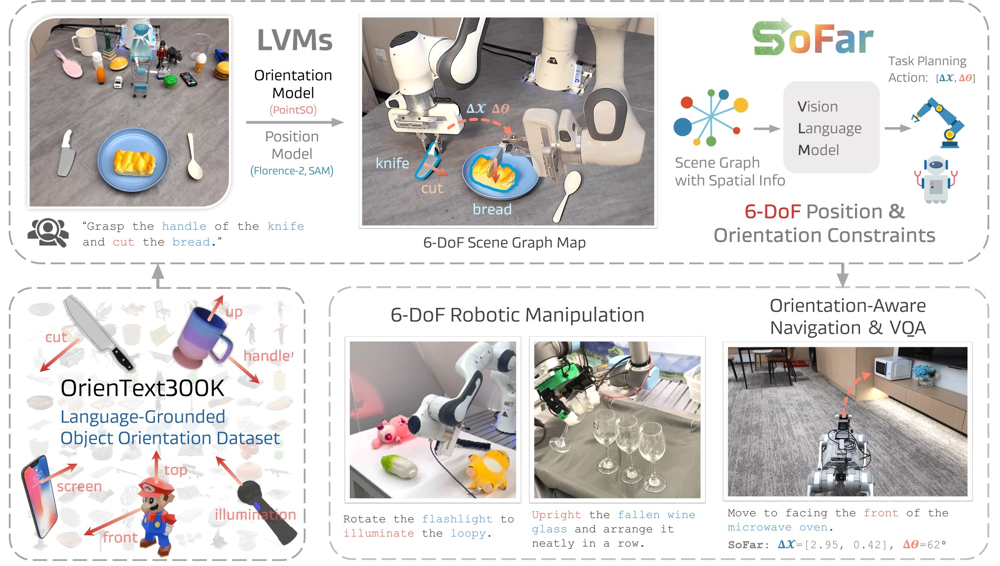
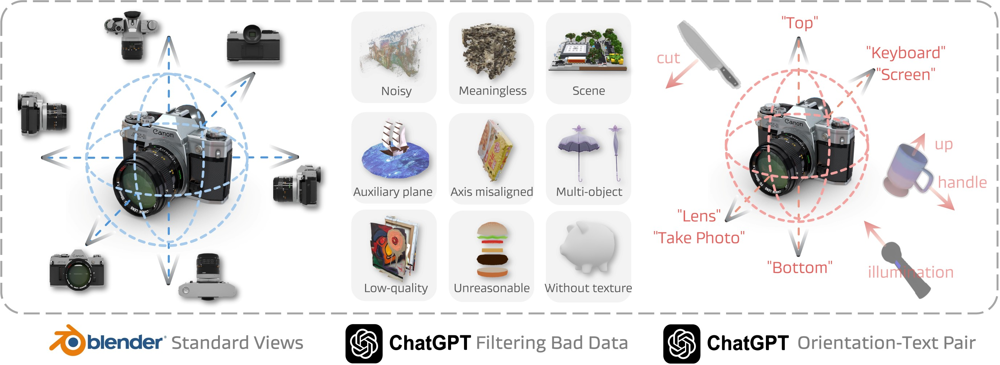
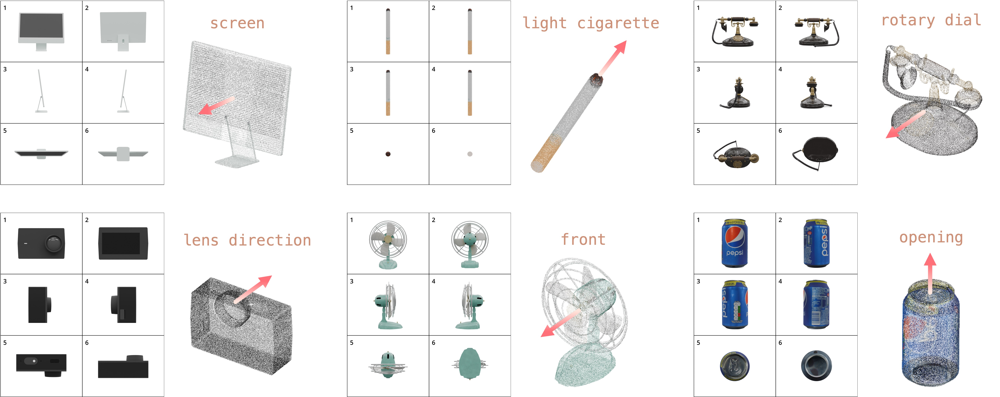

# SoFar: Language-Grounded Orientation Bridges Spatial Reasoning and Object Manipulation

We present SoFar, the first 6-DoF system for spatial reasoning and robotic manipulation.

We introduce the concept of **semantic orientation**, representing the object orientation condition on open vocabulary language.

[Zekun Qi](https://qizekun.github.io/) *, [Wenyao Zhang]() *, [Yufei Ding](https://selina2023.github.io/) *, [Runpei Dong](https://runpeidong.web.illinois.edu/), [Xinqiang Yu](), [Jingwen Li](), [Lingyun Xu](), [Baoyu Li](https://baoyuli.github.io/), [Xialin He](https://xialin-he.github.io/), [Guofan Fan](https://github.com/Asterisci/), [Jiazhao Zhang](https://jzhzhang.github.io/), [Jiawei He](https://jiaweihe.com/), [Jiayuan Gu](https://jiayuan-gu.github.io/), [Xin Jin](http://home.ustc.edu.cn/~jinxustc/), [Kaisheng Ma](http://group.iiis.tsinghua.edu.cn/~maks/leader.html), [Zhizheng Zhang](https://scholar.google.com/citations?user=X7M0I8kAAAAJ&hl=en), [He Wang](https://hughw19.github.io/) and [Li Yi](https://ericyi.github.io/).

[](https://qizekun.github.io/sofar/)
[](https://arxiv.org/abs/2502.13143)
[](https://huggingface.co/collections/qizekun/sofar-67b511129d3146d28cea9920)
[](https://github.com/tatsu-lab/stanford_alpaca/blob/main/LICENSE)
[](https://github.com/tatsu-lab/stanford_alpaca/blob/main/DATA_LICENSE)

[](https://paperswithcode.com/sota/object-rearrangement-on-open6dor-v2?p=sofar-language-grounded-orientation-bridges)
[](https://paperswithcode.com/sota/robot-manipulation-on-simpler-env?p=sofar-language-grounded-orientation-bridges)
[](https://paperswithcode.com/sota/robot-manipulation-on-simplerenv-widow-x?p=sofar-language-grounded-orientation-bridges)
[](https://paperswithcode.com/sota/spatial-reasoning-on-6-dof-spatialbench?p=sofar-language-grounded-orientation-bridges)
[](https://paperswithcode.com/sota/spatial-reasoning-on-embspatial-bench?p=sofar-language-grounded-orientation-bridges)

<div style="text-align: center;">
    
</div>

## Contents
- [Install](#quick-start)
- [Dataset](./datasets/DATASET.md)
- [SoFar](#sofar)
  - [Demo](#demo)
  - [Evaluation](#evaluation)
- [PointSO](#pointso)
  - [Pretrain](#pretrain)
  - [Finetune](#finetune)
- [OrienText300K](#orientext300k)
- [Open6DOR V2](#open6dor-v2)
- [6-DoF SpatialBench](#6-dof-spatialbench)
- [TODO](#todo)

## Quick-Start
Setup environment:
```bash
conda create -n sofar python=3.12 -y
conda activate sofar

git clone https://github.com/qizekun/SoFar.git
cd SoFar
pip install -e .
pip install -e segmentation/SAM
```

Download checkpoints:
```bash
mkdir checkpoints & cd checkpoints
# Florence-2
huggingface-cli download microsoft/Florence-2-base
# Segment Anything
wget -c https://dl.fbaipublicfiles.com/segment_anything/sam_vit_h_4b8939.pth
# PointSO
wget -c https://huggingface.co/qizekun/PointSO/resolve/main/small.pth
wget -c https://huggingface.co/qizekun/PointSO/resolve/main/base_finetune.pth
```
More detailed installation instructions can be found in [INSTALL.md](INSTALL.md).
Note that CPU devices inference for SoFar are also supported, such as **MacOS, Windows**, etc.

## SoFar
Our method is based on mature VLMs such as Qwen, ChatGPT, Gemini, etc., if you have an OpenAI key, you can obtain the service by setting the OpenAI key. Note that gemini-2.0-flash-exp is comparable and even better than the gpt-4o, especially the Open6DOR task.
```bash
export OPENAI_API_KEY=your_openai_key
```
Qwen-VL-2.5 can already handle embodied brain tasks.
If you do not have an OpenAI-API Key, you can achieve comparable performance by loading **Qwen**:
```bash
pip install qwen-vl-utils[decord]==0.0.8 triton
pip install flash-attn --no-build-isolation
python scripts/qwen_demo.py
```

### Demo
#### 6-DoF Object Rearrangement Demo
```bash
python scripts/open6dor_demo.py
```
#### Object Manipulation Demo
```bash
python scripts/manipulation_demo.py
```
#### Spatial Visual Question Answering Demo
```bash
python scripts/vqa_demo.py
```

### Evaluation

#### Object Manipulation on SimplerEnv
##### Google Robot Visual Matching
| Method                                              | Training Data | Pick Coke Can | Move Near | Open / Close Drawer | Average   |
|-----------------------------------------------------|---------------|---------------|-----------|---------------------|-----------|
| [Octo-Base](https://arxiv.org/pdf/2405.12213)       | OXE           | 0.170         | 0.042     | 0.227               | 0.168     |
| [OpenVLA](https://arxiv.org/pdf/2406.09246)         | OXE           | 0.163         | 0.462     | 0.356               | 0.277     |
| [RoboVLM](https://openreview.net/pdf?id=nfm2qcV1S4) | OXE           | 0.727         | 0.663     | 0.268               | 0.563     |
| [SpatialVLA](https://arxiv.org/pdf/2501.15830)      | OXE           | 0.810         | 0.696     | **0.593**           | 0.719     |
| **SoFar**                                           | -             | **0.923**     | **0.917** | 0.403               | **0.749** |

##### Widow-X Visual Matching
| Method                                              | Training Data | Put Spoon on Towel | Put Carrot on Plate | Stack Green Block on Yellow Block | Put Eggplant in Yellow Basket | Average   |
|-----------------------------------------------------|---------------|--------------------|---------------------|-----------------------------------|-------------------------------|-----------|
| [Octo-Base](https://arxiv.org/pdf/2405.12213)       | OXE           | 0.170              | 0.042               | 0.227                             | 0.168                         | 0.160     |
| [OpenVLA](https://arxiv.org/pdf/2406.09246)         | OXE           | 0.000              | 0.000               | 0.000                             | 0.041                         | 0.010     |
| [RoboVLM](https://openreview.net/pdf?id=nfm2qcV1S4) | OXE           | 0.208              | 0.250               | 0.083                             | 0.000                         | 0.135     |
| [SpatialVLA](https://arxiv.org/pdf/2501.15830)      | OXE           | 0.208              | 0.208               | 0.250                             | **0.708**                     | 0.344     |
| **SoFar**                                           | -             | **0.583**          | **0.667**           | **0.708**                         | 0.375                         | **0.583** |

We evaluate SoFar's performance on two tracks in SimplerEnv, and SoFar achieved SOTA performance in all cases. Due to the independent configuration of the environment, we provided detailed evaluation code in [SimplerEnv-SOFAR](https://github.com/Zhangwenyao1/SimplerEnv-SOFAR).

#### 6-DoF Object Rearrangement on Open6DOR V2
| Method                                                   | Position Track |          | Rotation Track |          |          | 6-DoF Track |
|----------------------------------------------------------|----------------|----------|----------------|----------|----------|-------------|
|                                                          | Level 0        | Level 1  | Level 0        | Level 1  | Level 2  | Overall     |
| [Dream2Real](https://arxiv.org/pdf/2312.04533)           | 17.2           | 11.0     | 37.3           | 27.6     | 26.2     | 13.5        |
| [VoxPoser](https://arxiv.org/pdf/2307.05973)             | 35.6           | 21.7     | -              | -        | -        | -           |
| [Open6DOR-GPT](https://openreview.net/pdf?id=RclUiexKMt) | 78.6           | 60.3     | 45.7           | 32.5     | 49.8     | 35.6        |
| SoFar-LLaVA                                              | 86.3           | 57.9     | 62.5           | 30.2     | 67.1     | 40.3        |
| **SoFar**                                                | **96.0**       | **81.5** | **68.6**       | **42.2** | **70.1** | **48.7**    |

Download the refined dataset following [DATASET.md](./datasets/DATASET.md).

```bash
# Predict on Open6DOR dataset
python open6dor/open6dor_perception.py
# Evaluate the metrics
python open6dor/eval_open6dor.py
```

Note that Open6DOR uses the **observer's perspective**, which means it is oriented relative to the robotic arm. 
This implies that the X-axis and Y-axis of the observer coordinate system are opposite to those of the robotic arm's base coordinate system. 
This is reflected in the system prompt: in the observer coordinate system, the Y-axis extends from left to right, and the X-axis extends from far to near.

Additionally, for the Open6DOR task, we recommend using **small_finetune.pth** as the orientation model in [pointso.py](./serve/pointso.py) to achieve better performance.

Open6DOR V2 execution environment & evaluation is available at [Open6DOR-Libero](https://github.com/Zhangwenyao1/Open6DOR_V2_Execution), you can see the readme for more instructions.

#### 6-DoF Spatial VQA on 6-DoF SpatialBench
| Method                                         | Position (rel.) | Position (abs.) | Orientation (rel.) | Orientation (abs.) | Total    |
|------------------------------------------------|-----------------|-----------------|--------------------|--------------------|----------|
| GPT-4o                                         | 49.4            | 28.4            | 44.2               | 25.8               | 36.2     |
| [SpaceLLaVA](https://arxiv.org/pdf/2401.12168) | 32.4            | 30.5            | 30.9               | 24.9               | 28.2     |
| [SpatialBot](https://arxiv.org/pdf/2406.13642) | 50.9            | 21.6            | 39.6               | 22.9               | 33.7     |
| [RoboPoint](https://arxiv.org/pdf/2406.10721)  | 43.8            | 30.8            | 33.8               | 25.8               | 33.5     |
| **SoFar**                                      | **59.6**        | **33.8**        | **54.6**           | **31.3**           | **43.9** |

Download the refined dataset following [DATASET.md](./datasets/DATASET.md).
```bash
python spatialbench/eval_spatialbench.py
```

## PointSO

The pipeline of PointSO is as follows:
1. We generate high-quality, standardized, upright 3D asset datasets [Orientext300K](#orientext300k) through filtering and automatic annotating, and produce corresponding semantic orientations.

2. Train PointSO by adding random rotation, single-view interference, and Gaussian noise (set in [config.yaml](./orientation/cfgs/train/base.yaml)) to 3D assets.

3. Inference with PointSO, in the real world, most point cloud data are partial and in free orientations.

The released weights is on [Huggingface PointSO](https://huggingface.co/qizekun/PointSO), and the code is in the [orientation](./orientation) folder.
### Pretrain
Download the PointMAE as initialization.
```bash
wget https://github.com/Pang-Yatian/Point-MAE/releases/download/main/pretrain.pth -P orientation/
```
Perpare the OrienText300K dataset following [DATASET.md](./datasets/DATASET.md).
```bash
cd orientation
sh train_ddp.sh
```
### Finetune
Perpare the Open6DOR finetuning dataset following [DATASET.md](./datasets/DATASET.md).
The dataset is generated from isaac sim with different assets from Open6DOR.
Finetune PointSO will significantly improve the performance on Open6DOR rotation track & 6-DoF track. 
We recommend using the finetuned version of PointSO for the Open6DOR V2 evaluation.
```bash
cd orientation
sh train_ddp_ft.sh
```

## Datasets & Benchmarks
### OrienText300K
We obtained the OrienText300K dataset by rendering multi-views of Objaverse and annotating with ChatGPT, including the filtering of Objaverse 1.0, 350K orientation-text pairs, and 8M multi-view images.
The complete multi-view data will be uploaded.

In addition, if your work requires filtering 3D data, the [attributes.zip](https://huggingface.co/datasets/qizekun/OrienText300K/blob/main/attributes.zip) we use to filter OrienText300K may be helpful for your work. 
We provide multi-view annotations for each object in Objaverse across multiple dimensions, removing low-quality, meaningless, noise, and 3D assets containing useless data.

<div style="text-align: center;">
    
</div>

OrienText300K samples, containing various objects and natural text for interaction.
<div style="text-align: center;">
    
</div>

Data open source on [Huggingface OrienteText300K](https://huggingface.co/datasets/qizekun/OrienText300K).

We also provide the code for rendering multi-views with Blender (version: 4.2.0) in [render_views.py](./datasets/orentext300k_render_views.py), so that you can reproduce or use it on your own dataset. 
This rendering code has undergone very complex debugging and testing. 
We would appreciate it if this code is useful to you and cite our paper.


### Open6DOR V2
A challenging and comprehensive benchmark for open-instruction 6-DoF object rearrangement tasks.

We remove the erroneous data from Open6DOR V1 and eliminated parts that required manual judgment to facilitate replication.
Open6DOR V2 contains ~4500 tasks for 6-DoF object rearrangement & spatial relationship evaluation.

Data open source on [Huggingface Open6DOR V2](https://huggingface.co/datasets/qizekun/Open6DOR_V2).

### 6-DoF SpatialBench
Previous spatial perception LLMs mainly focused on operations of positional relationships, such as left-right, near-far, size, and counting, etc. 
In actual object manipulation, the orientation of the object is also a very important factor. 
Therefore, we proposed a new 6-DoF spatial perception benchmark dataset for evaluating the model's reasoning capabilities in position, orientation, and position-orientation relationships. 
We evaluated existing spatial perception models on this benchmark dataset.

Data open source on [Huggingface 6-DoF SpatialBench](https://huggingface.co/datasets/qizekun/6DoF-SpatialBench).

## TODO
- [x] Release the evaluation code for Simpler-Env for Google Robot & Widow-X.
- [x] Release the inference code with Qwen-VL-2.5.
- [x] Add cpu devices inference support, such as MacOS.
- [x] Release the evaluation code for Open6DOR-Libero.
- [ ] Release the improved version of OrienText300K.
- [ ] Release gradio demo for SoFar & PointSO.
- [ ] Release the Objaverse-XL version dataset & PointSO.

## Contact
If you have any questions related to the code or the paper, feel free to email Zekun (`qizekun@gmail.com`). 


## Acknowledgements
- [Segment Anything](https://github.com/facebookresearch/segment-anything)
- [ReCon](https://github.com/qizekun/ReCon)
- [Florence-2](https://github.com/IDEA-Research/Grounded-SAM-2)
- [LLaVA](https://github.com/haotian-liu/LLaVA)


## Citation
If you find SoFar, PointSO, OrienText300K, Open6DOR V2 or 6-DoF SpatialBench helpful for your research, please consider citing the following BibTeX entry.
```BibTex
@article{qi2025sofar,
  author = {Qi, Zekun and Zhang, Wenyao and Ding, Yufei and Dong, Runpei and Yu, Xinqiang and Li, Jingwen and Xu, Lingyun and Li, Baoyu and He, Xialin and Fan, Guofan and Zhang, Jiazhao and He, Jiawei and Gu, Jiayuan and Jin, Xin and Ma, Kaisheng and Zhang, Zhizheng and Wang, He and Yi, Li},
  title        = {SoFar: Language-Grounded Orientation Bridges Spatial Reasoning and Object Manipulation},
  journal      = {CoRR},
  volume       = {abs/2502.13143},
  year         = {2025},
  url          = {https://doi.org/10.48550/arXiv.2502.13143},
  doi          = {10.48550/ARXIV.2502.13143},
  eprinttype    = {arXiv},
  eprint       = {2502.13143}
}
```
